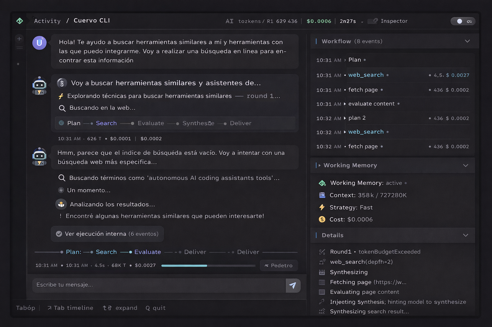

<p align="center">
  <picture>
    <source media="(prefers-color-scheme: dark)"  srcset="img/halcon-logo.png">
    <source media="(prefers-color-scheme: light)" srcset="img/halcon-logo-bg.png">
    
  </picture>
</p>

<p align="center">
  <em>AI-native terminal agent — routes intelligently, acts decisively</em>
</p>

<hr/>

<p align="center">
  <a href="https://github.com/cuervo-ai/halcon-cli/actions/workflows/ci.yml">
    
  </a>
  <a href="https://github.com/cuervo-ai/halcon-cli/releases/latest">
    
  </a>
  
  
  <a href="LICENSE">
    
  </a>
  <a href="https://github.com/cuervo-ai/halcon-cli/actions/workflows/devsecops.yml">
    
  </a>
</p>

<p align="center">
  <a href="QUICKSTART.md">Quickstart</a> ·
  <a href="docs/">Documentation</a> ·
  <a href="https://halcon.cuervo.cloud">Website</a> ·
  <a href="https://github.com/cuervo-ai/halcon-cli/releases">Releases</a> ·
  <a href="https://github.com/cuervo-ai/halcon-cli/issues">Issues</a>
</p>

---

Halcon is a production-grade AI development platform built in Rust and TypeScript. The core is a terminal agent that routes each task through a **Boundary Decision Engine** — intent classification, SLA budget calibration, model selection — before the first LLM call. A **FASE-2 security gate** enforces 18 catastrophic-pattern guards at the tool layer, independent of any agent configuration.

The platform ships as four integrated surfaces: a **CLI/REPL**, a **VS Code extension**, a **desktop control plane**, and a **bilingual website** — all sharing the same underlying agent loop and tool registry over a common protocol.

<p align="center">
  
</p>

---

## Table of Contents

- [Ecosystem Overview](#ecosystem-overview)
- [Quickstart](#quickstart)
- [CLI / REPL](#cli--repl)
  - [Installation](#installation)
  - [Commands](#commands)
  - [Agent Loop](#agent-loop)
  - [Memory Systems](#memory-systems)
  - [TUI](#tui)
- [VS Code Extension](#vs-code-extension)
- [Desktop App](#desktop-app)
- [MCP Integration](#mcp-integration)
- [LSP Server](#lsp-server)
- [Website](#website)
- [Providers](#providers)
- [Tools](#tools)
- [Configuration](#configuration)
- [Security](#security)
- [Architecture](#architecture)
- [Contributing](#contributing)

---

## Ecosystem Overview

<table>
<tr>
<th>Surface</th>
<th>Technology</th>
<th>Status</th>
<th>Purpose</th>
</tr>
<tr>
<td><b>CLI / REPL</b></td>
<td>Rust · ratatui</td>
<td>✅ Production</td>
<td>Terminal agent, 40+ commands, 60+ tools, TUI</td>
</tr>
<tr>
<td><b>VS Code Extension</b></td>
<td>TypeScript · xterm.js</td>
<td>✅ Production</td>
<td>In-editor AI assistant via JSON-RPC subprocess</td>
</tr>
<tr>
<td><b>Desktop App</b></td>
<td>Rust · egui</td>
<td>🚧 Alpha</td>
<td>Native GUI control plane for remote halcon-api instances</td>
</tr>
<tr>
<td><b>MCP Server</b></td>
<td>Rust · axum</td>
<td>✅ Production</td>
<td>Expose all tools as MCP endpoint (stdio or HTTP)</td>
</tr>
<tr>
<td><b>LSP Server</b></td>
<td>Rust · stdio</td>
<td>🚧 Alpha</td>
<td>Language Server Protocol bridge for IDEs</td>
</tr>
<tr>
<td><b>Control Plane API</b></td>
<td>Rust · axum · WebSocket</td>
<td>✅ Production</td>
<td>REST + streaming API for remote integrations</td>
</tr>
<tr>
<td><b>Website</b></td>
<td>Astro 5 · React 19 · Tailwind</td>
<td>✅ Production</td>
<td>Bilingual marketing site + documentation hub</td>
</tr>
</table>

**Protocol spine:** all surfaces connect to the agent loop through one of three transports:

```
VS Code extension  ──JSON-RPC stdin/stdout──▶  halcon-cli  ─┐
Desktop app        ──WebSocket /api/v1/ws──────▶ halcon-api  ├─▶ Agent Loop
MCP clients        ──stdio or HTTP Bearer──────▶ halcon mcp ─┘
```

---

## Quickstart

```sh
# 1. Install
curl -fsSL https://raw.githubusercontent.com/cuervo-ai/halcon-cli/main/scripts/install-binary.sh | sh

# 2. Configure
export ANTHROPIC_API_KEY="sk-ant-..."
# or: halcon auth login anthropic

# 3. Run
halcon                                           # interactive REPL
halcon --tui                                     # 3-panel TUI mode
halcon "refactor the auth module to TokenStore"  # one-shot task
```

---

## CLI / REPL

### Installation

**macOS / Linux:**
```sh
curl -fsSL https://raw.githubusercontent.com/cuervo-ai/halcon-cli/main/scripts/install-binary.sh | sh
```

**Windows (PowerShell):**
```powershell
iwr -useb https://raw.githubusercontent.com/cuervo-ai/halcon-cli/main/scripts/install-binary.ps1 | iex
```

**Homebrew:**
```sh
brew tap cuervo-ai/tap && brew install halcon
```

**Cargo:**
```sh
cargo install --git https://github.com/cuervo-ai/halcon-cli --features tui --locked
```

<details>
<summary><b>Build from source</b></summary>

```sh
git clone https://github.com/cuervo-ai/halcon-cli.git
cd halcon-cli
cargo build --release --features tui -p halcon-cli
# binary: target/release/halcon
```

| Feature flag | Default | Effect |
|---|---|---|
| `tui` | ✓ | ratatui 3-panel TUI |
| `color-science` | ✓ | momoto perceptual color metrics |
| `headless` | — | disables TUI, forces classic render |
| `vendored-openssl` | — | static OpenSSL for musl/cross targets |

</details>

<details>
<summary><b>Verify + supported targets</b></summary>

```sh
halcon --version    # halcon 0.3.0 (aarch64-apple-darwin)
halcon doctor       # full system diagnostics
```

| Target | Platform |
|--------|---------|
| `aarch64-apple-darwin` | macOS Apple Silicon |
| `x86_64-apple-darwin` | macOS Intel |
| `x86_64-unknown-linux-musl` | Linux x86\_64 (static) |
| `aarch64-unknown-linux-gnu` | Linux ARM64 |
| `x86_64-pc-windows-msvc` | Windows x64 |

All release artifacts are signed with [cosign](https://sigstore.dev) keyless signing.

</details>

---

### Commands

```
halcon [OPTIONS] [PROMPT]                         interactive REPL or one-shot task
halcon chat   [--tui] [--orchestrate] [--tasks]   explicit chat with flags
halcon init   [--force]                            project init wizard
halcon status                                      runtime state
halcon doctor                                      system diagnostics
halcon update [--check] [--force]                 self-update
halcon theme                                       theme generation

halcon auth   login|logout|status PROVIDER        API key management (OS keychain)
halcon config show|get|set|path                   configuration CRUD

halcon agents list|validate                        sub-agent registry
halcon memory list|search|prune|stats|clear       persistent memory
halcon tools  list|validate|doctor|add|remove     tool registry
halcon audit  export|list|verify                  SOC 2 audit log
halcon metrics show|export|prune|decide           performance baselines

halcon trace  export SESSION_ID                   JSONL session export
halcon replay SESSION_ID [--verify]               deterministic replay

halcon mcp    add|remove|list|get|auth|serve      MCP server management
halcon lsp                                         Language Server (stdio)
halcon plugin list|install|remove|status          plugin management
```

<details>
<summary><b>Global flags</b></summary>

```
--model MODEL          model override
--provider PROVIDER    provider override (anthropic|openai|ollama|deepseek|gemini|claude-code)
--verbose              debug logging
--log-level LEVEL      trace|debug|info|warn|error
--config PATH          alternate config file
--no-banner            suppress startup banner
--mode MODE            interactive|json-rpc
--max-turns N          agent loop turn limit
--trace-json PATH      write JSON trace
```

</details>

---

### Agent Loop

Each session runs through six phases per round:

```
round_setup → provider_round → post_batch → convergence_phase → result_assembly → checkpoint
```

<details>
<summary><b>Boundary Decision Engine (pre-loop)</b></summary>

Before any LLM call, `IntentPipeline::resolve()` runs:

1. **InputNormalizer** — strips zero-width chars, detects language (EN/ES/Mixed), normalizes whitespace
2. **BoundaryDecisionEngine** — classifies routing mode: `QuickAnswer` · `Balanced` · `DeepAnalysis`
3. **IntentPipeline** — reconciles intent score + boundary decision → `ResolvedIntent { effective_max_rounds }`
4. **ConvergenceController** — initialized with pre-reconciled budget (single source of truth)

**Constitutional constraint:** `DeepAnalysis` routing mode is never downgraded.

**Escalation triggers** (RoutingAdaptor, per round):
- T1: security signals detected in round feedback
- T2: tool failure rate ≥ 60%
- T3: evidence coverage < 25% at round ≥ 4
- T4: combined convergence score > 0.90 at round ≥ 3

</details>

<details>
<summary><b>Tool execution safety</b></summary>

Two independent security layers:

1. **FASE-2 path gate** — 18 catastrophic patterns from `halcon_core::security::CATASTROPHIC_PATTERNS` checked before execution. Cannot be bypassed by configuration or hooks.
2. **DANGEROUS_COMMAND_PATTERNS** — 12 G7 patterns in the same source file. Shared by `bash.rs` and `command_blacklist.rs`.

Rules:
- `bash`, `file_read`, `grep` are never stripped from `cached_tools` post-delegation
- `run_command` → `bash` alias resolved before tool-surface narrowing
- Destructive tools blocked from parallel batches (sequential only)

</details>

---

### Memory Systems

<details>
<summary><b>1. HALCON.md — Persistent Instructions</b></summary>

4-scope hierarchy injected as `## Project Instructions` into every session:

| Scope | Path | Notes |
|---|---|---|
| Local | `./HALCON.local.md` | git-ignored, personal dev overrides |
| User | `~/.halcon/HALCON.md` | global personal preferences |
| Project | `.halcon/HALCON.md` + `.halcon/rules/*.md` | YAML `paths:` glob filtering |
| Managed | `/etc/halcon/HALCON.md` | operator policy, highest LLM weight |

Hot-reload via `notify::recommended_watcher` (FSEvents/inotify, <100ms), `@import` resolution (depth 3, cycle detection, 64 KiB cap).

</details>

<details>
<summary><b>2. Auto-Memory — Event-Triggered Knowledge Capture</b></summary>

Automatically captures knowledge during sessions. Storage: `.halcon/memory/MEMORY.md` (180-line LRU) + `.halcon/memory/<topic>.md` (50-entry per topic).

| Trigger | Score |
|---|---|
| User correction | 1.0 |
| Error recovery | 0.5 + magnitude |
| Tool pattern discovered | 0.6 |
| Task success | 0.2 + complexity |

Threshold: `memory_importance_threshold = 0.3`. Background write — never blocks response.

```sh
halcon memory search "auth patterns"
halcon memory list --type code_snippet
halcon memory clear project
```

</details>

<details>
<summary><b>3. Vector Memory — Semantic Search</b></summary>

TF-IDF hash embeddings + cosine similarity + MMR (max marginal relevance) retrieval, backed by `VectorMemoryStore`. Surfaced via `search_memory` tool and `halcon memory search`.

</details>

---

### TUI

```sh
halcon --tui          # or: halcon chat --tui
```

3-zone layout (ratatui):

| Zone | Content |
|---|---|
| Left panel | Activity timeline — tool calls, agent badges, round markers, virtual scroll |
| Center | Prompt editor (tui-textarea, multiline) + streamed response |
| Right panel | Working memory — context budget bar, session statistics |

**Keyboard shortcuts:**

| Key | Action |
|---|---|
| `Enter` | Submit prompt |
| `Shift+Enter` | Newline in prompt |
| `Tab` | Cycle focus zones |
| `Ctrl+C` | Cancel in-progress request |
| `Ctrl+L` | Clear activity timeline |
| `Ctrl+Y` | Copy last response to clipboard |
| `↑/↓/PgUp/PgDn` | Scroll activity timeline |
| `Esc` | Dismiss modal / overlay |

Features: conversational permission overlay (inline tool approval), sub-agent progress badges, context budget bar, toast notifications, clipboard support (arboard), panic hook restores terminal.

---

## VS Code Extension

<p align="center">
  
</p>

The extension spawns `halcon --mode json-rpc` as a subprocess and communicates over newline-delimited JSON. The UI is rendered in a **xterm.js 5.3** terminal inside a VS Code WebviewPanel.

### Install

```sh
# From VSIX (until marketplace publication)
code --install-extension halcon-*.vsix

# Or: open halcon-vscode/ in VS Code → F5 to run in extension host
```

### Commands & Keybindings

| Command | Shortcut | Description |
|---|---|---|
| `Halcon: Open Panel` | `Ctrl/Cmd+Shift+H` | Open / reveal the Halcon panel |
| `Halcon: Ask About Selection` | `Ctrl/Cmd+Shift+A` | Pre-fill selected code as context |
| `Halcon: Edit File` | — | Request AI improvement of current file |
| `Halcon: New Session` | — | Clear history, start fresh |
| `Halcon: Cancel Task` | — | Send cancel signal to agent |

### Configuration

| Setting | Default | Description |
|---|---|---|
| `halcon.binaryPath` | `""` | Override bundled binary path |
| `halcon.model` | `""` | Model override (e.g. `claude-sonnet-4-6`) |
| `halcon.maxTurns` | `20` | Max agent loop turns (1–100) |
| `halcon.provider` | `""` | Provider override (e.g. `anthropic`) |

### Context Injection

On each request, the extension automatically appends a `context` object:

```json
{
  "activeFile": {
    "uri": "/path/to/file.rs",
    "language": "rust",
    "content": "... (≤50 KB)",
    "selection": "selected text if any"
  },
  "diagnostics": [ ... ],
  "git": { "branch": "main", "staged": 2, "unstaged": 1 },
  "workspaceRoot": "/path/to/project"
}
```

### JSON-RPC Protocol

The extension communicates via NDJSON over subprocess stdin/stdout:

**Extension → halcon:**
```json
{"id": 1, "method": "ping"}
{"method": "chat", "params": {"message": "...", "context": {...}}}
{"method": "cancel"}
```

**halcon → Extension (streaming):**
```json
{"event": "pong", "id": 1}
{"event": "token",       "data": {"text": "streamed text"}}
{"event": "thinking",    "data": {"text": "..."}}
{"event": "tool_call",   "data": {"name": "bash", "input": {...}}}
{"event": "tool_result", "data": {"success": true, "output": "..."}}
{"event": "done"}
{"event": "error",       "data": "error message"}
```

### Process Management

- **Binary resolution:** user config → bundled binary (`bin/` for darwin-arm64, darwin-x64, linux-x64, win32-x64) → PATH fallback
- **Health check:** ping/pong RPC every 5s; auto-restart on failure (5× exponential backoff, max 10s)
- **Windows:** wraps subprocess in `cmd /c` to avoid stdio buffering issues

### File Edit Workflow

When the agent proposes a file edit, the extension:
1. Opens a VS Code diff editor (`halcon-diff:` content scheme) showing before/after
2. Renders Apply / Reject buttons in the webview panel
3. On Apply: `workspace.applyEdit()` writes changes atomically

---

## Desktop App

A native **egui** desktop application that connects to a remote `halcon-api` instance. Designed as a control plane for teams running Halcon in server mode.

> **Status: Alpha** — architecture and workers are complete; view implementations (data binding, charts) are in progress.

### Launch

```sh
# Start the API server first
HALCON_API_TOKEN=my-token halcon serve --port 9849

# Then launch the desktop app (separate binary)
HALCON_SERVER_URL=http://127.0.0.1:9849 \
HALCON_API_TOKEN=my-token \
halcon-desktop
```

### Navigation

8-tab layout (egui):

| Tab | Content |
|---|---|
| Dashboard | System overview, active sessions, quick stats |
| Agents | Registered sub-agents, execution history |
| Tasks | Task queue, execution timeline |
| Tools | Available tools, usage statistics |
| Protocols | Connected MCP servers, protocol status |
| Files | Remote file browser with WebSocket streaming |
| Metrics | Performance dashboard — memory, latency, token counts |
| Logs | Structured logging view |

### Technical Details

- **UI framework:** `egui` 0.29 (immediate-mode) + `eframe` (native window)
- **Async runtime:** tokio workers with mpsc channels (256-slot commands, 1024-slot messages)
- **Connection:** WebSocket at `/api/v1/ws`, REST at `/api/v1/`, Bearer token auth
- **Frame rate:** 60 FPS; token streaming rate-limited to 10 tokens/frame (~600 tokens/s) to maintain <16ms frame time
- **Config:** TOML-backed `AppConfig` (server URL, auth token, theme, window state)

### Environment Variables

```sh
HALCON_SERVER_URL=http://127.0.0.1:9849   # API server address
HALCON_API_TOKEN=<token>                   # Bearer token
```

---

## MCP Integration

Halcon operates as both an MCP **server** and an MCP **client**.

### Run as MCP Server

```sh
# Claude Code / any MCP client via stdio
claude mcp add halcon -- halcon mcp serve

# HTTP server with Bearer auth
halcon mcp serve --transport http --port 7777
# → prints: HALCON_MCP_SERVER_API_KEY=<auto-generated 48-char hex>
```

The HTTP server (axum) supports:
- `POST /mcp` — JSON-RPC request body
- `GET /mcp` — SSE streaming
- `Mcp-Session-Id` header — session management with TTL expiry (default 30 min)
- Bearer token auth via `HALCON_MCP_SERVER_API_KEY`
- Full audit tracing of all tool calls

### Connect to MCP Servers

```sh
halcon mcp add filesystem --command "npx @modelcontextprotocol/server-filesystem /path"
halcon mcp add my-api     --url https://api.example.com/mcp
halcon mcp auth my-api    # OAuth 2.1 + PKCE flow → token stored in keychain
halcon mcp list
```

**Config** (`~/.halcon/mcp.toml`):
```toml
[[servers]]
name    = "filesystem"
command = ["npx", "@modelcontextprotocol/server-filesystem", "/home/user"]

[[servers]]
name      = "my-api"
url       = "https://api.example.com/mcp"
auth.type = "bearer"
auth.env  = "MY_API_TOKEN"   # ${VAR:-default} expansion supported
```

3-scope config: local `.halcon/mcp.toml` > project > user `~/.halcon/mcp.toml`.

**Tool discovery:** `ToolSearchIndex` (nucleo-matcher fuzzy search) defers full tool listing above 10% context threshold. A synthetic `search_tools_definition` tool lets the agent search for tools by name/description.

---

## LSP Server

```sh
halcon lsp
```

Starts a **Language Server Protocol** stdio server — content-length framed JSON-RPC:

```
Content-Length: 42\r\n\r\n{"jsonrpc":"2.0","method":"initialize",...}
```

Routes to `DevGateway` for `textDocument/*` and custom `$/halcon/*` methods.

> **Status: Alpha** — framing and exit detection are complete; method handlers (`textDocument/didOpen`, `textDocument/definition`, etc.) are under active development. The harness is stable; suitable for integration testing.

---

## Website

**[halcon.cuervo.cloud](https://halcon.cuervo.cloud)**

Built with **Astro 5** (static output) + **React 19** + **Tailwind CSS**. No backend — purely static, CDN-served.

### Pages

| Route | Content |
|---|---|
| `/` | Homepage (EN) — hero, provider cards, feature grid |
| `/es/` | Homepage (ES) — fully translated |
| `/docs` | Documentation landing (EN) |
| `/es/docs` | Documentation landing (ES) |
| `/download` | Multi-platform download with auto-detection |
| `/es/download` | Download (ES) |
| `/playground` | Interactive REPL simulator (React) |
| `/materials` | Research papers and blog links |

### Smart Download

The `/download` page auto-detects platform (macOS arm64/x64, Linux x64, Windows x64) and shows the matching binary, checksum verification steps, and platform-specific install instructions.

### Build

```sh
cd website
npm ci
npm run build    # outputs to dist/
npm run preview  # local preview
```

---

## Providers

| Provider | Models | Transport | Vision | Tool Use |
|---|---|---|:---:|:---:|
| **Anthropic** | Claude Opus 4.6, Sonnet 4.6, Haiku 4.5 | SSE | ✓ | ✓ |
| **OpenAI** | GPT-4o, o1, o3-mini | SSE | ✓ | ✓ |
| **Ollama** | Llama, Mistral, Qwen, Phi, CodeLlama… | NDJSON | ✓ | ✓ |
| **DeepSeek** | DeepSeek Coder, Chat, Reasoner | OpenAI-compat | — | ✓ |
| **Google Gemini** | Gemini Pro, Flash, Ultra | SSE | ✓ | ✓ |
| **Claude Code** | claude CLI subprocess | Stdio JSON-RPC | — | ✓ |
| **OpenAI-compat** | Any OpenAI-compatible API | SSE | ✓ | ✓ |
| **Echo** | Debug / testing | Sync | — | — |
| **Replay** | Deterministic trace reproduction | Offline | — | — |

---

## Tools

60+ native tools with typed JSON schemas, `RiskTier`, and per-directory allow-lists.

<details>
<summary><b>Full inventory by category</b></summary>

**File Operations (7):** `file_read` · `file_write` · `file_edit` · `file_delete` · `directory_tree` · `file_inspect` · `file_diff`

**Shell & System (5):** `bash` (FASE-2 guarded) · `glob` · `env_inspect` · `process_list` · `port_check`

**Background Jobs (3):** `background_start` · `background_output` · `background_kill`

**Search (5):** `grep` · `web_fetch` · `web_search` · `native_search` (BM25 + PageRank + semantic) · `semantic_grep`

**Git (8):** `git_status` · `git_diff` · `git_log` · `git_add` · `git_commit` · `git_blame` · `git_branch` · `git_stash`

**Data & Transform (6):** `json_transform` · `json_schema_validate` · `sql_query` · `template_engine` · `test_data_gen` · `openapi_validate`

**Code Quality (7):** `execute_test` · `test_run` · `code_coverage` · `code_metrics` · `lint_check` · `perf_analyze` · `dependency_graph`

**Infrastructure (9):** `docker_tool` · `process_monitor` · `make_tool` · `dep_check` · `http_probe` · `http_request` · `task_track` · `ci_logs` · `checksum`

**Security (2):** `secret_scan` · `path_security`

**Utilities (8):** `url_parse` · `regex_test` · `token_count` · `parse_logs` · `changelog_gen` · `archive` · `diff_apply` · `patch_apply`

**Memory (1):** `search_memory` — semantic search over auto-memory and vector store

</details>

**Risk tiers** — enforced at the executor before execution:

| Tier | Examples | Behavior |
|---|---|---|
| `ReadOnly` | `file_read`, `grep`, `git_status` | Runs without confirmation |
| `ReadWrite` | `git_add`, `task_track` | Runs without confirmation |
| `Destructive` | `bash`, `file_write`, `git_commit` | Requires confirmation; blocked from parallel batches |

---

## Configuration

### `~/.halcon/config.toml`

```toml
[general]
default_provider = "anthropic"
default_model    = "claude-sonnet-4-6"
max_tokens       = 8192
temperature      = 0.0

[models.providers.anthropic]
enabled       = true
api_key_env   = "ANTHROPIC_API_KEY"
default_model = "claude-sonnet-4-6"

[models.providers.ollama]
enabled       = true
api_base      = "http://localhost:11434"
default_model = "llama3.2"

[tools]
confirm_destructive  = true
timeout_secs         = 120
allowed_directories  = ["/home/user/projects"]
blocked_patterns     = ["**/.env", "**/*.key", "**/*.pem"]

[security]
pii_detection          = true
pii_action             = "warn"  # warn | block | redact
audit_enabled          = true
audit_retention_days   = 90
```

### Config hierarchy

```
CLI flags  →  env vars  →  ./.halcon/config.toml  →  ~/.halcon/config.toml  →  defaults
```

### Environment variables

```sh
ANTHROPIC_API_KEY=sk-ant-...
OPENAI_API_KEY=sk-...
DEEPSEEK_API_KEY=sk-...
GEMINI_API_KEY=...
OLLAMA_HOST=http://localhost:11434

HALCON_MODEL=claude-sonnet-4-6
HALCON_PROVIDER=anthropic
HALCON_LOG=debug

# MCP / Desktop
HALCON_MCP_SERVER_API_KEY=...
HALCON_SERVER_URL=http://127.0.0.1:9849
HALCON_API_TOKEN=...
```

---

## Security

**FASE-2 gate** — 18 catastrophic patterns in `halcon-core/src/security.rs`:
filesystem destruction, credential exfiltration, fork bombs, kernel module loading, raw disk access, `/proc/sysrq-trigger`.

**DANGEROUS_COMMAND_PATTERNS** — 12 named G7 patterns (crypto miners, reverse shells, privilege escalation). Both lists compile from a single source file shared by `bash.rs` and `command_blacklist.rs`.

**TBAC** — every tool declares `PermissionLevel` (ReadOnly / ReadWrite / Destructive) and `AllowedDirectories`. Violations reject before execution.

**PII detection** — configurable warn / block / redact on inputs and outputs.

**Keychain** — API keys stored in OS keychain (macOS Keychain, Linux Secret Service, Windows Credential Manager). Never written to config files unless explicitly overridden.

**Audit log** — append-only SQLite audit trail with HMAC-SHA256 chain validation. SOC 2-compatible export: `halcon audit export --format jsonl`, `halcon audit verify SESSION_ID`.

**Lifecycle hooks** — shell or Rhai sandboxed scripts on 6 events. Exit code 2 = Deny (stdout → reason shown to user). FASE-2 is structurally independent of hook outcomes.

See [SECURITY.md](SECURITY.md) for vulnerability disclosure policy.

---

## Architecture

<details>
<summary><b>19-crate workspace</b></summary>

```
halcon-cli/
├── crates/
│   ├── halcon-cli/          # binary — REPL, TUI, commands, agent loop (337 files, ~40K LOC)
│   ├── halcon-core/         # domain types, traits, security — zero I/O
│   ├── halcon-providers/    # AI adapters: 7 providers (Anthropic, OpenAI, Ollama, DeepSeek, Gemini, ClaudeCode, compat)
│   ├── halcon-tools/        # 60+ tool implementations (75 files)
│   ├── halcon-mcp/          # MCP client + HTTP server, OAuth 2.1, tool search (13 files)
│   ├── halcon-context/      # 7-tier context engine, embeddings, vector store (18 files)
│   ├── halcon-storage/      # SQLite persistence, migrations, audit, cache, metrics (33 files)
│   ├── halcon-runtime/      # DAG executor for parallel tool batches (21 files)
│   ├── halcon-search/       # BM25 + PageRank search engine (35 files)
│   ├── halcon-agent-core/   # GDEM experimental agent loop (26 files)
│   ├── halcon-multimodal/   # image, audio, document processing (20 files)
│   ├── halcon-api/          # axum REST + WebSocket control plane API (25 files)
│   ├── halcon-auth/         # keychain, OAuth device flow, JWT
│   ├── halcon-security/     # guardrails, PII detection
│   ├── halcon-files/        # file access controls, 12 format handlers
│   ├── halcon-client/       # async typed HTTP + WebSocket SDK
│   ├── halcon-sandbox/      # rlimit / seccomp sandboxing
│   ├── halcon-desktop/      # egui control plane app (alpha)
│   └── halcon-integrations/ # plugin extensibility framework
├── halcon-vscode/           # VS Code extension — TypeScript, xterm.js, JSON-RPC
├── website/                 # Astro 5 + React 19 marketing site
├── config/default.toml      # built-in defaults
├── docs/                    # documentation
└── scripts/                 # install, release, test scripts
```

</details>

<details>
<summary><b>Domain boundaries</b></summary>

`halcon-core` is a strict boundary — zero I/O, zero async, zero network. All 32 domain modules compile with no infrastructure dependencies.

```
halcon-cli / halcon-desktop / halcon-vscode (surfaces)
          ↓
halcon-providers, halcon-tools, halcon-mcp, halcon-context, halcon-storage, halcon-api
          ↓
halcon-core  (pure domain — types, traits, events, security patterns)
```

</details>

<details>
<summary><b>Agent loop module map</b></summary>

```
crates/halcon-cli/src/repl/
├── agent/
│   ├── mod.rs               # run_agent_loop() — 2,537 lines
│   ├── loop_state.rs        # LoopState (62 fields)
│   ├── context.rs           # AgentContext → 3 sub-structs
│   ├── round_setup.rs       # per-round init, HALCON.md hot-reload
│   ├── provider_round.rs    # LLM API call, retry, circuit breaker
│   ├── post_batch.rs        # tool execution + FASE-2 gate
│   ├── convergence_phase.rs # SynthesisGate → TerminationOracle → RoutingAdaptor
│   ├── result_assembly.rs   # output + auto-memory scoring
│   └── checkpoint.rs        # session persistence + trace
├── decision_engine/
│   ├── intent_pipeline.rs   # IntentPipeline::resolve()
│   ├── routing_adaptor.rs   # 4-trigger escalation
│   ├── policy_store.rs      # runtime SLA constants
│   └── ...
├── domain/
│   ├── convergence_controller.rs
│   ├── termination_oracle.rs
│   ├── synthesis_gate.rs
│   └── ...
├── auto_memory/             # scorer, writer, injector
├── instruction_store/       # HALCON.md 4-scope loader + hot-reload
├── hooks/                   # lifecycle hooks — shell + Rhai
├── agent_registry/          # sub-agent loader, validator, skills
└── vector_memory_source.rs  # VectorMemoryStore ContextSource
```

</details>

---

## Contributing

Read [docs/CONTRIBUTING.md](docs/CONTRIBUTING.md) for the full workflow.

```sh
git clone https://github.com/cuervo-ai/halcon-cli.git
cd halcon-cli

# Build CLI
cargo build --features tui -p halcon-cli

# Build VS Code extension
cd halcon-vscode && npm ci && npm run build

# Build website
cd website && npm ci && npm run build

# Test suite (4,300+ tests, ~2 min on M-series)
cargo test --workspace --no-default-features

# Lint
cargo clippy --workspace --no-default-features -- -D warnings
cargo fmt --all -- --check
```

**Commit format** ([Conventional Commits](https://www.conventionalcommits.org/)):
`feat` · `fix` · `refactor` · `docs` · `test` · `chore` · `ci`

**Branch strategy:** `feature/*` → PR → `main`. CI gates on Linux; macOS runs post-merge.

---

## License

Apache License 2.0 — see [LICENSE](LICENSE).

---

<p align="center">
  <picture>
    <source media="(prefers-color-scheme: dark)"  srcset="img/cuervo-cloud-logo.png">
    <source media="(prefers-color-scheme: light)" srcset="img/cuervo-logo-2.png">
    
  </picture>
  <br/>
  <sub>Built by <a href="https://github.com/cuervo-ai">Cuervo AI</a></sub>
</p>
