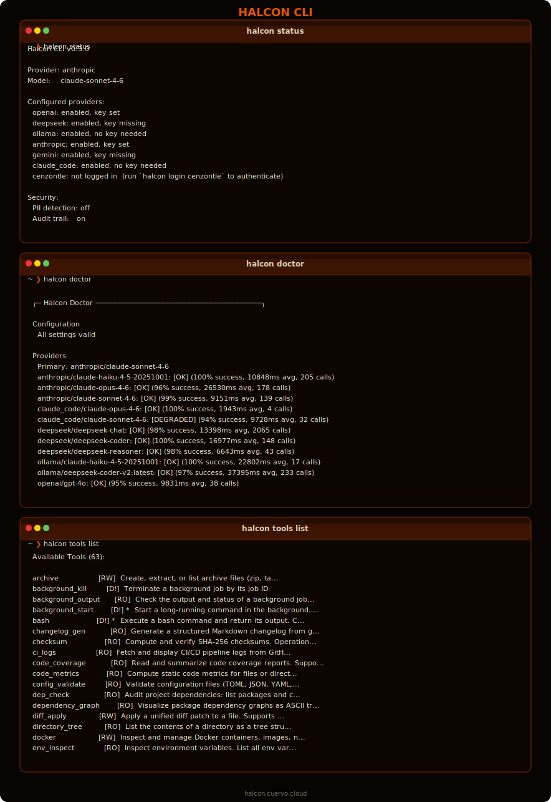
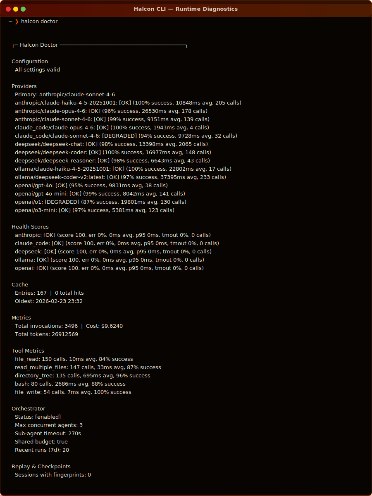
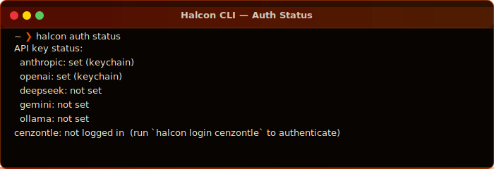
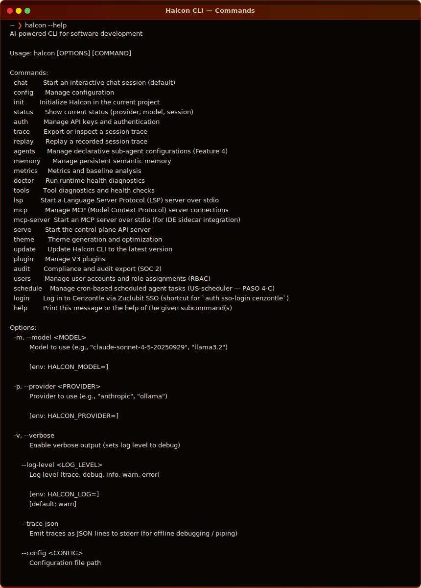
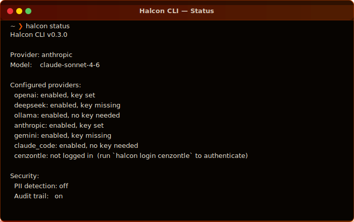
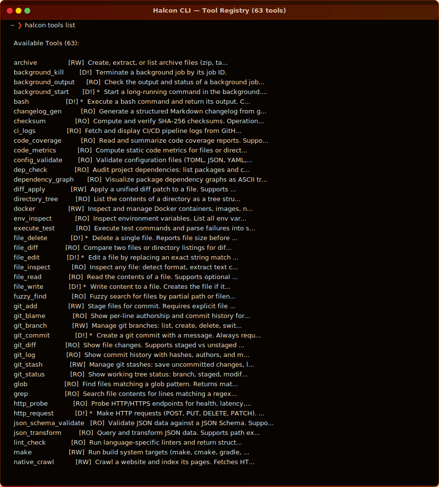
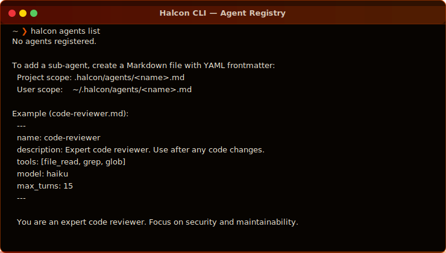
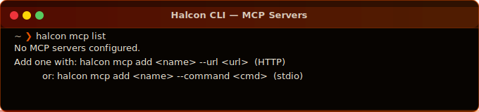

<!-- OpenGraph / Social metadata -->
<!--
  og:title       = Halcon CLI — AI-native terminal agent
  og:description = Production-grade AI agent CLI in Rust. Routes tasks through intent classification, SLA calibration, and model selection before the first LLM call.
  og:image       = https://halcon.cuervo.cloud/img/og-card.png
  og:url         = https://github.com/cuervo-ai/halcon-cli
  twitter:card   = summary_large_image
-->

<!-- Machine-readable metadata for package registries and AI tools -->
<!-- HALCON_CLI_VERSION: 0.3.0 -->
<!-- HALCON_CLI_CAPABILITIES: chat,tui,mcp,sso,agents,tools,audit,lsp,serve,schedule -->
<!-- HALCON_CLI_PROVIDERS: anthropic,openai,gemini,ollama,deepseek,bedrock,vertex,cenzontle,claude_code -->
<!-- HALCON_CLI_SURFACES: cli,tui,vscode,desktop,mcp-server,lsp,github-actions -->
<!-- TAGS: cli,rust,ai,agent,mcp,sso,tui,llm,anthropic,openai,tool-use,audit -->

<p align="center">
  <picture>
    <source media="(prefers-color-scheme: dark)"  srcset="img/halcon-logo.png">
    <source media="(prefers-color-scheme: light)" srcset="img/halcon-logo-bg.png">
    
  </picture>
</p>

<p align="center">
  <strong>AI-native terminal agent — routes intelligently, acts decisively</strong>
</p>

<p align="center">
  <a href="https://github.com/cuervo-ai/halcon-cli/actions/workflows/ci.yml">
    
  </a>
  <a href="https://github.com/cuervo-ai/halcon-cli/releases/latest">
    
  </a>
  
  
  <a href="LICENSE">
    
  </a>
  <a href="https://github.com/cuervo-ai/halcon-cli/actions/workflows/devsecops.yml">
    
  </a>
</p>

<p align="center">
  <a href="docs/getting-started/README.md">Getting Started</a> ·
  <a href="docs/">Documentation</a> ·
  <a href="https://halcon.cuervo.cloud">Website</a> ·
  <a href="https://github.com/cuervo-ai/halcon-cli/releases">Releases</a> ·
  <a href="docs/LLMS.txt">AI-readable docs</a>
</p>

---

<!-- AI-DESCRIPTION: Hero section. Halcon CLI is a production-grade AI development platform built in Rust. It is a terminal agent that routes each user task through a Boundary Decision Engine (intent classification, SLA budget, model selection) before making any LLM call. A FASE-2 security gate enforces 18 catastrophic-pattern guards at the tool layer, independent of agent configuration. -->

<p align="center">
  
</p>

---

## Overview

Halcon is a **production-grade AI development platform** written in Rust and TypeScript. The core is a terminal agent that routes each task through a **Boundary Decision Engine** — intent classification (HybridIntentClassifier with heuristic + embedding + optional LLM layers), SLA budget calibration, and model selection — before the first LLM call ever happens. This means the right model is always used for the right task, at the right cost.

A **FASE-2 security gate** enforces 18 catastrophic-pattern guards at the tool layer, blocking destructive operations regardless of how an agent is configured, what provider is active, or whether the call comes from the CLI, the VS Code extension, an HTTP MCP client, or a sub-agent inside an orchestrated task graph.

The platform ships as **seven integrated surfaces** that all share the same agent loop and tool registry over a common protocol: CLI/REPL, VS Code extension, desktop control plane, bilingual website, GitHub Actions native action, MCP server, and LSP server.

---

## What's New in v0.3.0

<!-- AI-DESCRIPTION: Changelog highlights for v0.3.0. Key additions: Cenzontle SSO via Zuclubit OAuth2.1, HybridIntentClassifier with 6 phases including adaptive learning and ambiguity detection, Compliance Audit Export (SOC 2 JSONL/CSV/PDF), Declarative Sub-Agent Registry with YAML frontmatter, MCP OAuth 2.1 with PKCE and tool search, Halcon as MCP Server over HTTP/SSE, VS Code Extension MVP, Semantic Memory Vector Store, and Lifecycle Hooks. -->

| Area | Feature |
|------|---------|
| **Auth** | Cenzontle SSO via Zuclubit OAuth 2.1 — `halcon login` |
| **Intelligence** | HybridIntentClassifier — heuristic + embedding + LLM deliberation, adaptive learning (UCB1 bandit), ambiguity detection |
| **Compliance** | SOC 2 audit export — JSONL, CSV, PDF with HMAC-SHA256 chain verification |
| **Agents** | Declarative sub-agent registry — YAML frontmatter `.halcon/agents/*.md` |
| **MCP** | Full MCP ecosystem — OAuth 2.1 PKCE, tool search (nucleo), HTTP SSE server, multi-scope config |
| **Memory** | Semantic vector store — TF-IDF hash projections, MMR retrieval, `search_memory` tool |
| **IDE** | VS Code extension MVP — JSON-RPC subprocess bridge, xterm.js panel, edit proposals |
| **Infra** | Halcon as MCP server — `halcon mcp serve --transport http --port 7777` |
| **Hooks** | Lifecycle hooks — pre/post tool, session start/end, custom shell commands |
| **Scheduler** | Cron-based agent tasks — `halcon schedule add` |

---

## Quickstart

```bash
# 1. Install (macOS / Linux)
curl -fsSL https://halcon.cuervo.cloud/install.sh | sh

# 2. Set your API key
halcon auth set-key anthropic

# 3. Check everything works
halcon doctor

# 4. Start a session
halcon chat

# 5. (Optional) Log in to Cenzontle SSO
halcon login
```

<p align="center">
  
</p>

---

## Platform Coverage

<!-- AI-DESCRIPTION: Halcon ships as 7 integrated surfaces. All share the same underlying agent loop, tool registry, and FASE-2 security gate. -->

| Surface | Entry point | Language | Status |
|---------|-------------|----------|--------|
| **CLI / REPL** | `halcon chat` | Rust | GA |
| **TUI** | `halcon --tui` (or press `t` in REPL) | Rust + ratatui | GA |
| **VS Code Extension** | `halcon --mode json-rpc` | TypeScript | Beta |
| **Desktop App** | `halcon-desktop` | Rust + egui | Beta |
| **MCP Server** | `halcon mcp serve` | Rust + axum | GA |
| **LSP Server** | `halcon lsp` | Rust | Beta |
| **GitHub Actions** | `uses: cuervo-ai/halcon-action@v1` | YAML | GA |

---

## Providers

<!-- AI-DESCRIPTION: Halcon supports 9 AI providers. Each provider is independently configured and can be selected per-session or per-request. Cenzontle SSO authenticates through Zuclubit, the internal identity provider, using OAuth 2.1 with PKCE. -->

| Provider | Models | Auth method | Notes |
|----------|--------|-------------|-------|
| **Anthropic** | claude-sonnet-4-6, claude-opus-4-6, claude-haiku-4-5 | API key | Default provider |
| **OpenAI** | gpt-4o, gpt-4o-mini, o1, o3-mini | API key | Full tool-use |
| **Gemini** | gemini-2.0-flash, gemini-pro | API key | Multimodal |
| **Ollama** | Any local model | None | Air-gap compatible |
| **DeepSeek** | deepseek-chat, deepseek-coder, deepseek-reasoner | API key | Cost-optimized |
| **AWS Bedrock** | Claude, Titan, Llama | IAM role / OIDC | Enterprise |
| **Vertex AI** | Gemini, Claude | GCP service account | Enterprise |
| **Claude Code** | claude-opus-4-6, claude-sonnet-4-6 | None (subprocess) | IDE-native |
| **Cenzontle** | All Anthropic models | Zuclubit SSO | Enterprise SSO |

### Cenzontle SSO via Zuclubit

Cenzontle is the enterprise identity layer. Authentication flows through **Zuclubit** (OAuth 2.1 with PKCE) and issues short-lived access tokens that Halcon automatically refreshes.

```
User                  Halcon CLI             Zuclubit              Cenzontle
 │                        │                      │                      │
 │  halcon login          │                      │                      │
 │──────────────────────► │                      │                      │
 │                        │  /authorize (PKCE)   │                      │
 │                        │─────────────────────►│                      │
 │  browser opens         │                      │                      │
 │◄───────────────────────│                      │                      │
 │                        │                      │                      │
 │  user authenticates    │                      │                      │
 │──────────────────────────────────────────────►│                      │
 │                        │                      │                      │
 │                        │  code (loopback :9876)│                     │
 │                        │◄─────────────────────│                      │
 │                        │                      │                      │
 │                        │  /token exchange      │                      │
 │                        │─────────────────────►│                      │
 │                        │  access_token         │                      │
 │                        │◄─────────────────────│                      │
 │                        │                                             │
 │                        │  API calls with Bearer token               │
 │                        │────────────────────────────────────────────►
 │  AI response           │                                             │
 │◄───────────────────────│◄────────────────────────────────────────────
```

```bash
# Login via SSO
halcon login

# Check SSO status
halcon auth status

# Use Cenzontle provider directly
halcon chat --provider cenzontle --model claude-sonnet-4-6
```

---

## Authentication

<p align="center">
  
</p>

```bash
# Set an API key (stored in system keychain)
halcon auth set-key anthropic

# List all configured keys
halcon auth status

# Cenzontle SSO login
halcon login

# Use a specific key file (air-gap environments)
export ANTHROPIC_API_KEY="$(cat /secure/keys/anthropic.key)"
halcon chat
```

Keys are stored in the **system keychain** (macOS Keychain, Linux Secret Service, Windows Credential Manager). No plaintext keys on disk.

**Air-gap mode**: Set `ANTHROPIC_API_KEY` (or any provider key) as an environment variable. No keychain required. Works with Ollama for fully offline operation.

---

## Commands

<p align="center">
  
</p>

<!-- AI-DESCRIPTION: Complete command reference for halcon CLI v0.3.0. Each command is grouped by category. -->

### Session & Chat

```bash
halcon chat                        # Interactive REPL (default)
halcon chat --provider ollama      # Use specific provider
halcon chat -m claude-opus-4-6     # Use specific model
halcon chat --no-banner            # Suppress startup banner
halcon --tui                       # Full TUI mode
```

### Status & Diagnostics

```bash
halcon status                      # Provider, model, session info
halcon doctor                      # Full runtime health check
halcon metrics show                # Usage baselines and cost
halcon metrics export              # Export baselines to JSON
```

### Authentication

```bash
halcon auth status                 # All configured keys
halcon auth set-key anthropic      # Set API key (keychain)
halcon login                       # Cenzontle SSO login
halcon users list                  # RBAC user management
halcon users add --role editor     # Add user with role
```

### Agents & Orchestration

```bash
halcon agents list                 # Show registered sub-agents
halcon agents list --verbose       # With capabilities detail
halcon agents validate             # Validate all agent configs
halcon schedule list               # Cron-scheduled agent tasks
halcon schedule add --cron "0 9 * * *" --agent reviewer
```

### Tools

```bash
halcon tools list                  # All 63 tools with permissions
halcon tools list --filter bash    # Filter by name
halcon tools health                # Tool connectivity check
```

### MCP Integration

```bash
halcon mcp list                    # Configured MCP servers
halcon mcp add myserver --url https://mcp.example.com
halcon mcp add local --command "npx @modelcontextprotocol/server-filesystem"
halcon mcp serve                   # Run Halcon as MCP server (stdio)
halcon mcp serve --transport http --port 7777  # HTTP+SSE mode
```

### Compliance & Audit

```bash
halcon audit list                  # List audit sessions
halcon audit export --format jsonl # Export SOC 2 audit trail
halcon audit export --format csv   # CSV export
halcon audit export --format pdf   # PDF report
halcon audit verify <session-id>   # Verify HMAC chain integrity
```

### Configuration & Memory

```bash
halcon config show                 # Show current configuration
halcon config set model claude-opus-4-6
halcon memory list                 # Persistent memory entries
halcon memory add "prefer TypeScript over JavaScript"
halcon init                        # Initialize .halcon/ in project
```

---

## Status Dashboard

<p align="center">
  
</p>

---

## Tool Registry

<!-- AI-DESCRIPTION: Halcon ships with 63 built-in tools organized by permission tier. [RO] = read-only, [RW] = read-write, [D!] = destructive (requires explicit approval in TUI, auto-approved in --yes mode). -->

<p align="center">
  
</p>

Tools are organized by permission tier:

| Tier | Badge | Description |
|------|-------|-------------|
| Read-only | `[RO]` | No side effects — file reads, search, metrics |
| Read-write | `[RW]` | Reversible changes — git add, stash, archive |
| Destructive | `[D!]` | Irreversible — file write/delete, bash, git commit |

`*` marks tools that require explicit user approval in TUI mode. In non-interactive mode, use `--yes` to auto-approve (use with care).

### Tool categories

File system · Git operations · Search & grep · HTTP requests · Docker · Background jobs · Code analysis · Test execution · Dependency audit · JSON/CSV transforms · Secret scanning · Syntax validation · MCP bridging · Semantic memory search

---

## Agent Loop

<!-- AI-DESCRIPTION: The Halcon agent loop architecture. Each user request goes through: 1) HybridIntentClassifier (heuristic fast-path → embedding cosine similarity → optional LLM deliberation), 2) SLA budget calibration based on complexity and latency requirements, 3) Model selection via BDE routing table, 4) Planning (LLM planner generates structured step graph), 5) Tool execution with FASE-2 gate, 6) Convergence checking (TerminationOracle), 7) Result assembly. Sub-agents can be spawned for parallel work, sharing a token budget. -->

```
┌─────────────────────────────────────────────────────────────────┐
│                      User Request                               │
└─────────────────────────┬───────────────────────────────────────┘
                          │
                          ▼
┌─────────────────────────────────────────────────────────────────┐
│              HybridIntentClassifier                             │
│  ① heuristic fast-path (≥0.88 confidence → skip LLM)          │
│  ② embedding cosine similarity (PrototypeStore)                 │
│  ③ AmbiguityAnalyzer (NarrowMargin / HighEntropy / CrossDomain)│
│  ④ LLM deliberation (claude-haiku, only if ambiguous)          │
│  ⑤ adaptive learning (UCB1 bandit, EMA centroid updates)       │
└─────────────────────────┬───────────────────────────────────────┘
                          │
                          ▼
┌─────────────────────────────────────────────────────────────────┐
│              Boundary Decision Engine (BDE)                     │
│  · SLA budget calibration (latency / cost / quality tiers)     │
│  · Model selection (balanced score = success × speed × cost)   │
│  · Provider routing (health-aware, circuit-breaker)             │
└─────────────────────────┬───────────────────────────────────────┘
                          │
                          ▼
┌─────────────────────────────────────────────────────────────────┐
│                  Planning Phase                                 │
│  · LLMPlanner generates structured step graph                   │
│  · Complexity estimator calibrates round budget                 │
│  · Sub-agent tasks identified and queued                        │
└─────────────────────────┬───────────────────────────────────────┘
                          │
                ┌─────────┴──────────┐
                ▼                    ▼
    ┌─────────────────┐   ┌────────────────────┐
    │  Tool Execution │   │   Sub-Agent Loop   │
    │                 │   │  (parallel, shared │
    │  ████████████   │   │   token budget)    │
    │  FASE-2 Gate    │   └────────────────────┘
    │  18 guards      │
    │  provider-agnostic
    └────────┬────────┘
             │
             ▼
┌─────────────────────────────────────────────────────────────────┐
│              Convergence Check (TerminationOracle)              │
│  · Goal progress score                                          │
│  · Oscillation detection                                        │
│  · Round budget enforcement                                     │
│  · Synthesis gate (final summary assembly)                      │
└─────────────────────────────────────────────────────────────────┘
```

---

## Sub-Agent Registry

<!-- AI-DESCRIPTION: Halcon's declarative sub-agent system. Agents are defined as Markdown files with YAML frontmatter. They are discovered from three scopes: session (--agents flag), project (.halcon/agents/), and user (~/.halcon/agents/). Agents are validated for kebab-case names, description presence, max_turns 1-100, and skill references. -->

<p align="center">
  
</p>

Define agents as Markdown files with YAML frontmatter:

```markdown
---
name: code-reviewer
description: Expert code reviewer. Invoked after any code change.
tools: [file_read, grep, glob, git_diff]
model: haiku
max_turns: 15
skills: [security-review, style-guide]
---

You are an expert code reviewer. Focus on security vulnerabilities,
performance regressions, and maintainability. Always cite line numbers.
```

**Discovery scopes** (highest priority first):

| Scope | Path | Use case |
|-------|------|----------|
| Session | `--agents path/to/agent.md` | One-off overrides |
| Project | `.halcon/agents/*.md` | Team-shared agents |
| User | `~/.halcon/agents/*.md` | Personal defaults |

```bash
# Validate agent configurations
halcon agents validate

# List with details
halcon agents list --verbose

# Use a specific agent in chat
halcon chat --agents .halcon/agents/code-reviewer.md
```

---

## MCP Integration

<!-- AI-DESCRIPTION: Halcon has full MCP (Model Context Protocol) ecosystem support. It can act as both an MCP client (connecting to external MCP servers) and an MCP server itself. As a client it supports HTTP+SSE and stdio transports, OAuth 2.1 PKCE authentication, multi-scope TOML configuration, and fuzzy tool search via nucleo-matcher. As a server it exposes all 63 Halcon tools over HTTP+SSE with Bearer auth and session management, or via stdio for Claude desktop/IDE integration. -->

<p align="center">
  
</p>

### Halcon as MCP Client

```bash
# Add an HTTP MCP server
halcon mcp add filesystem --url https://mcp.example.com

# Add a stdio MCP server
halcon mcp add local --command "npx @modelcontextprotocol/server-filesystem /path"

# Authenticate with OAuth
halcon mcp auth filesystem

# List all configured servers
halcon mcp list
```

Multi-scope configuration (`.halcon/mcp.toml`, `~/.halcon/mcp.toml`, `.halcon/mcp.local.toml`):

```toml
[servers.filesystem]
transport = "http"
url       = "https://mcp.example.com"
auth      = "oauth2"

[servers.local-docs]
transport = "stdio"
command   = "npx @modelcontextprotocol/server-filesystem"
args      = ["/home/user/docs"]
```

### Halcon as MCP Server

```bash
# Stdio (for Claude desktop / IDE)
halcon mcp serve

# HTTP + SSE (for remote clients)
halcon mcp serve --transport http --port 7777

# Integrate with Claude Code
claude mcp add halcon -- halcon mcp serve
```

Set `HALCON_MCP_SERVER_API_KEY` for HTTP authentication. Auto-generates a 48-char hex key on first start if `require_auth=true`.

---

## TUI Mode

Halcon ships with a full terminal user interface built on [ratatui](https://ratatui.rs/):

```bash
halcon --tui          # Launch directly in TUI mode
# or press 't' during a REPL session
```

Features:
- Activity timeline with tool execution feed
- Working memory panel (context window visualization)
- Conversational overlay with input history
- Permission modals for destructive tool approval
- Live token budget display
- Session history navigation

---

## Security & Compliance

<!-- AI-DESCRIPTION: Security architecture. FASE-2 (Filtro de Accion con Seguridad Estricta v2) is a 18-pattern guard at the tool execution layer. It blocks catastrophic operations regardless of agent configuration, provider, or call path. Guards cover: rm -rf style deletions, fork bombs, credential exfiltration, kernel module loading, network firewall modifications, container escape patterns, and more. The audit trail records all tool calls with HMAC-SHA256 chaining for tamper detection. SOC 2 Type II export is available via `halcon audit export`. -->

### FASE-2 Security Gate

18 catastrophic-pattern guards enforced at the tool layer, **independent of any agent configuration**:

```
Guards active on: bash, file_write, file_delete, http_request, docker, background_start
Patterns blocked: rm -rf / | fork bombs | credential theft | kernel modules
                  firewall modification | container escape | history manipulation
                  privilege escalation | /etc/passwd modification
```

Works regardless of: provider (Anthropic / OpenAI / Ollama / Cenzontle / …), transport (REPL / HTTP / MCP / VS Code / sub-agent), authentication state.

### Audit Trail (SOC 2)

All tool calls are recorded with HMAC-SHA256 chain:

```bash
# Export full audit trail
halcon audit export --session <id> --format pdf

# Verify chain integrity (exits 1 if tampered)
halcon audit verify <session-id>

# Compliance event taxonomy
# AGENT_SESSION_START/END · TOOL_CALL · TOOL_BLOCKED
# SAFETY_GATE_TRIGGER · CIRCUIT_BREAKER_ACTIVATION
# TERMINATION_ORACLE_DECISION · REPLAN_TRIGGERED · MEMORY_WRITE
```

### RBAC

```bash
halcon users list
halcon users add alice@company.com --role editor
halcon users remove alice@company.com
# Roles: viewer, editor, admin, operator
```

---

## Configuration

Default config path: `~/.halcon/config.toml`

```toml
[agent]
provider = "anthropic"
model    = "claude-sonnet-4-6"

[agent.limits]
max_rounds   = 40
max_tokens   = 200000
max_cost_usd = 5.0

[security]
pii_detection    = false
audit_trail      = true
fase2_enabled    = true

[features]
enable_semantic_memory  = true
semantic_memory_top_k   = 5
enable_agent_registry   = true
enable_tui              = false

[mcp]
# MCP server config lives in ~/.halcon/mcp.toml or .halcon/mcp.toml
```

### Environment Variables

| Variable | Description |
|----------|-------------|
| `ANTHROPIC_API_KEY` | Anthropic API key |
| `OPENAI_API_KEY` | OpenAI API key |
| `GEMINI_API_KEY` | Google Gemini API key |
| `DEEPSEEK_API_KEY` | DeepSeek API key |
| `CENZONTLE_ACCESS_TOKEN` | Cenzontle SSO token (set by `halcon login`) |
| `HALCON_MODEL` | Override model |
| `HALCON_PROVIDER` | Override provider |
| `HALCON_CONFIG` | Override config file path |
| `HALCON_LOG` | Log level (trace/debug/info/warn/error) |
| `HALCON_MCP_SERVER_API_KEY` | Bearer token for `halcon mcp serve --transport http` |

---

## Installation

### macOS / Linux (recommended)

```bash
curl -fsSL https://halcon.cuervo.cloud/install.sh | sh
```

### Homebrew (macOS)

```bash
brew tap cuervo-ai/tap
brew install halcon
```

### Cargo (from source)

```bash
cargo install --git https://github.com/cuervo-ai/halcon-cli halcon-cli
```

### Pre-built binaries

Download from [Releases](https://github.com/cuervo-ai/halcon-cli/releases):

| Platform | Architecture | File |
|----------|-------------|------|
| macOS | Apple Silicon | `halcon-aarch64-apple-darwin.tar.gz` |
| macOS | Intel | `halcon-x86_64-apple-darwin.tar.gz` |
| Linux | x86_64 | `halcon-x86_64-unknown-linux-musl.tar.gz` |
| Linux | ARM64 | `halcon-aarch64-unknown-linux-musl.tar.gz` |
| Windows | x86_64 | `halcon-x86_64-pc-windows-msvc.zip` |

### VS Code Extension

```bash
# Via command palette
ext install cuervo-ai.halcon

# Or install from VSIX
code --install-extension halcon-vscode-0.3.0.vsix
```

---

## Architecture

<!-- AI-DESCRIPTION: Halcon crate graph. The workspace has 20 crates. halcon-core defines all traits and types. halcon-providers implements 9 AI providers. halcon-tools implements 63 tools. halcon-agent-core has the FSM, planner, critic, and verifier. halcon-cli is the main binary with REPL, TUI, and all command handlers. halcon-runtime is the sub-agent execution engine. halcon-mcp is the MCP client/server. halcon-context manages the token context window. halcon-search is the semantic search engine. halcon-storage is the SQLite persistence layer. -->

```
┌──────────────────────────────────────────────────────────────┐
│                    halcon-cli (binary)                       │
│  commands/ · repl/ · tui/ · render/ · audit/ · agent_bridge │
└──────┬──────────────┬─────────────┬───────────────┬─────────┘
       │              │             │               │
       ▼              ▼             ▼               ▼
┌──────────┐  ┌──────────────┐ ┌─────────┐  ┌──────────────┐
│halcon-   │  │halcon-agent- │ │halcon-  │  │halcon-       │
│runtime   │  │core          │ │mcp      │  │context       │
│          │  │              │ │         │  │              │
│sub-agent │  │fsm · planner │ │oauth ·  │  │sliding-window│
│executor  │  │critic ·      │ │http-sse │  │vector-store  │
│spawner   │  │verifier ·    │ │tool-    │  │cold-archive  │
│registry  │  │oscillation   │ │search   │  │semantic      │
└──────┬───┘  └──────────────┘ └─────────┘  └──────────────┘
       │
       ▼
┌──────────────────────────────────────────────────────────────┐
│                    halcon-core (traits + types)               │
│  ChatExecutor · Planner · Provider · MetricsSink · Tool      │
│  AppConfig · ModelRequest · ToolCall · AgentState            │
└──────┬──────────────────────────┬────────────────────────────┘
       │                          │
       ▼                          ▼
┌──────────────┐          ┌───────────────┐
│halcon-       │          │halcon-tools   │
│providers     │          │               │
│              │          │bash · file_*  │
│anthropic     │          │git_* · grep   │
│openai        │          │docker · http  │
│gemini        │          │search_memory  │
│ollama        │          │63 tools total │
│deepseek      │          └───────────────┘
│bedrock       │
│vertex        │          ┌───────────────┐
│cenzontle     │          │halcon-storage │
│claude_code   │          │               │
└──────────────┘          │SQLite · WAL   │
                          │sessions ·     │
┌──────────────┐          │metrics ·      │
│halcon-search │          │audit_log ·    │
│              │          │checkpoints    │
│TF-IDF index  │          └───────────────┘
│inverted idx  │
│embeddings    │          ┌───────────────┐
│RAGAS eval    │          │halcon-security│
└──────────────┘          │               │
                          │FASE-2 guards  │
                          │RBAC policies  │
                          └───────────────┘
```

### Workspace crates

| Crate | Role |
|-------|------|
| `halcon-core` | Traits and types — the contract every crate depends on |
| `halcon-cli` | Main binary: REPL, TUI, commands, agent loop |
| `halcon-providers` | 9 AI provider implementations |
| `halcon-tools` | 63 built-in tools |
| `halcon-agent-core` | FSM, planner, critic, verifier, telemetry |
| `halcon-runtime` | Sub-agent executor, spawner, federation router |
| `halcon-mcp` | MCP client + server (HTTP/SSE + stdio) |
| `halcon-context` | Context window: hot buffer, cold archive, vector store |
| `halcon-search` | Semantic search, TF-IDF, RAGAS evaluation |
| `halcon-storage` | SQLite persistence (WAL mode) |
| `halcon-auth` | RBAC, JWT, Cenzontle token management |
| `halcon-security` | FASE-2 guards, guardrails, rate limiting |
| `halcon-api` | Control plane REST + WebSocket API |
| `halcon-multimodal` | Image/video pipeline, MIME detection |
| `halcon-sandbox` | Execution sandbox policies |
| `halcon-files` | CSV, Excel, PDF, archive handlers |
| `halcon-integrations` | Third-party event hub |
| `halcon-desktop` | egui desktop app |
| `halcon-client` | HTTP client for control plane API |
| `cuervo-cli` | Internal shell integration |

---

## CI/CD Integration

```yaml
# .github/workflows/ai-review.yml
name: AI Code Review
on: [pull_request]

jobs:
  review:
    runs-on: ubuntu-latest
    steps:
      - uses: actions/checkout@v4
      - uses: cuervo-ai/halcon-action@v1
        with:
          task: "Review this PR for security issues and bugs. Check diff carefully."
          provider: anthropic
          model: claude-sonnet-4-6
        env:
          ANTHROPIC_API_KEY: ${{ secrets.ANTHROPIC_API_KEY }}
```

---

## Contributing

See [CONTRIBUTING.md](CONTRIBUTING.md) for full details.

Quick setup:

```bash
git clone https://github.com/cuervo-ai/halcon-cli
cd halcon-cli
cargo build --workspace
cargo test --workspace
```

Branch naming: `feature/`, `fix/`, `docs/`, `test/`, `chore/`

Run the test suite before opening a PR:

```bash
cargo test --workspace          # 12,670 tests
cargo clippy --workspace        # lints
cargo fmt --check               # formatting
```

---

## License

Apache 2.0 — see [LICENSE](LICENSE).

---

<p align="center">
  <a href="https://halcon.cuervo.cloud">halcon.cuervo.cloud</a> ·
  <a href="https://github.com/cuervo-ai/halcon-cli">GitHub</a> ·
  <a href="docs/LLMS.txt">AI-readable docs</a>
</p>
