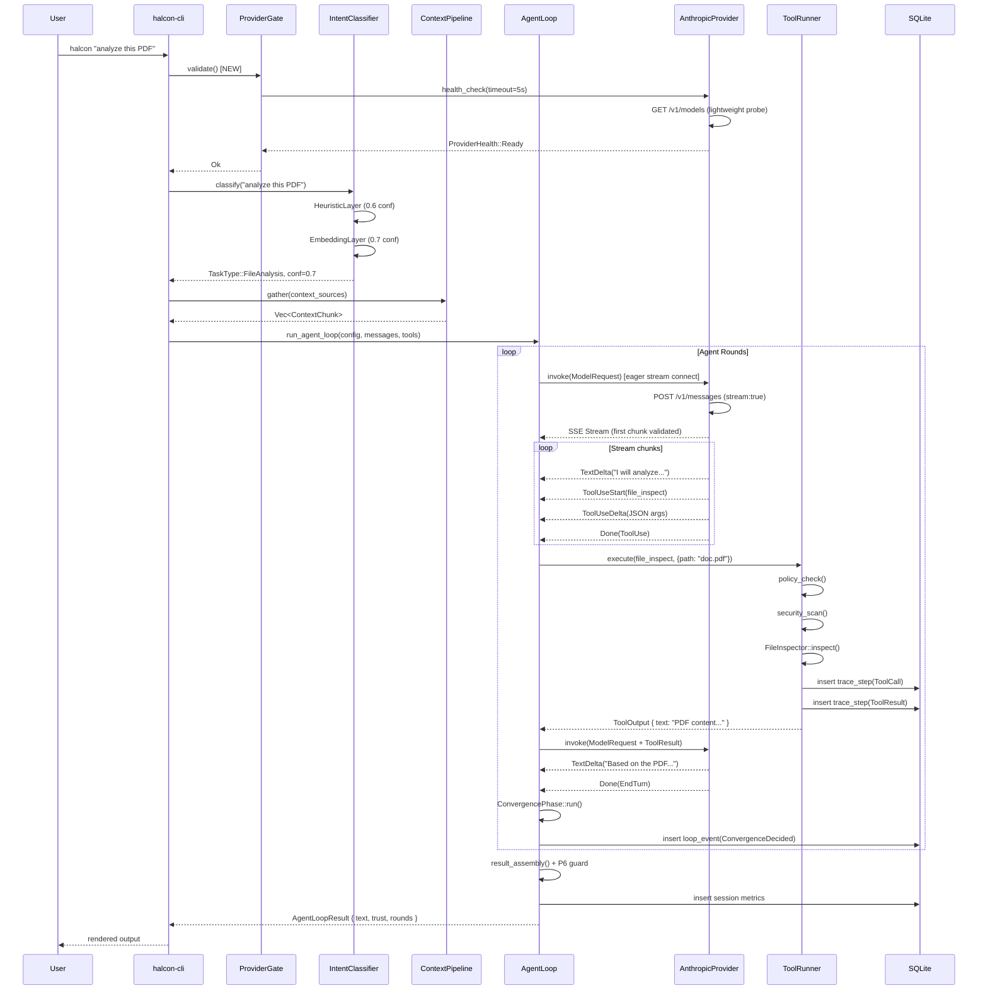
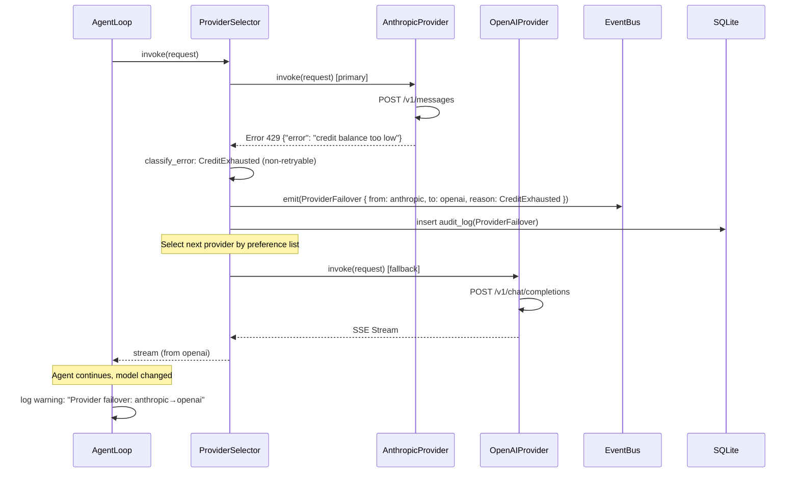
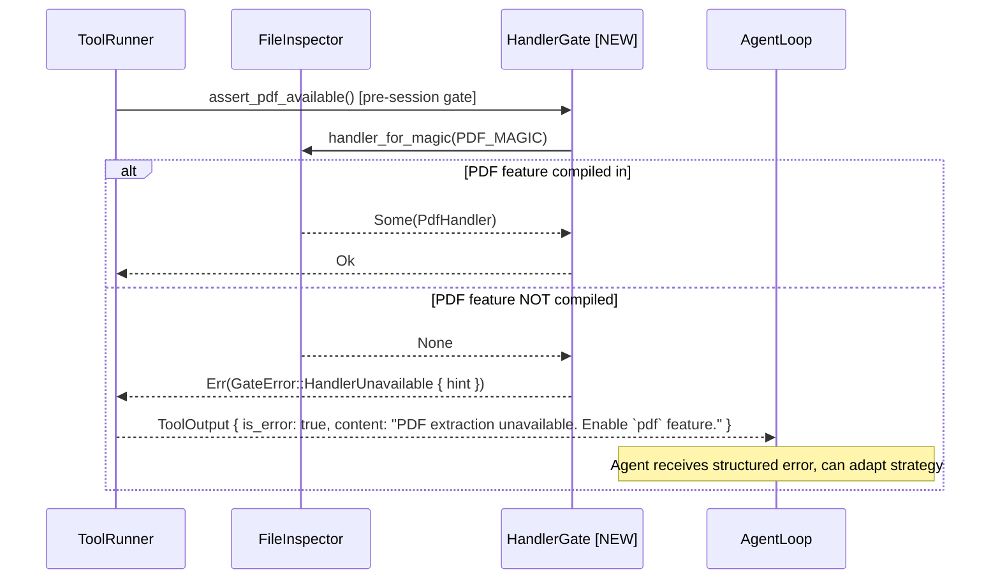
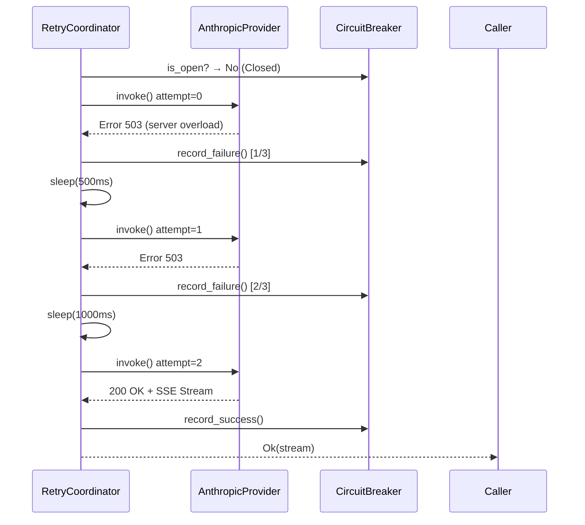
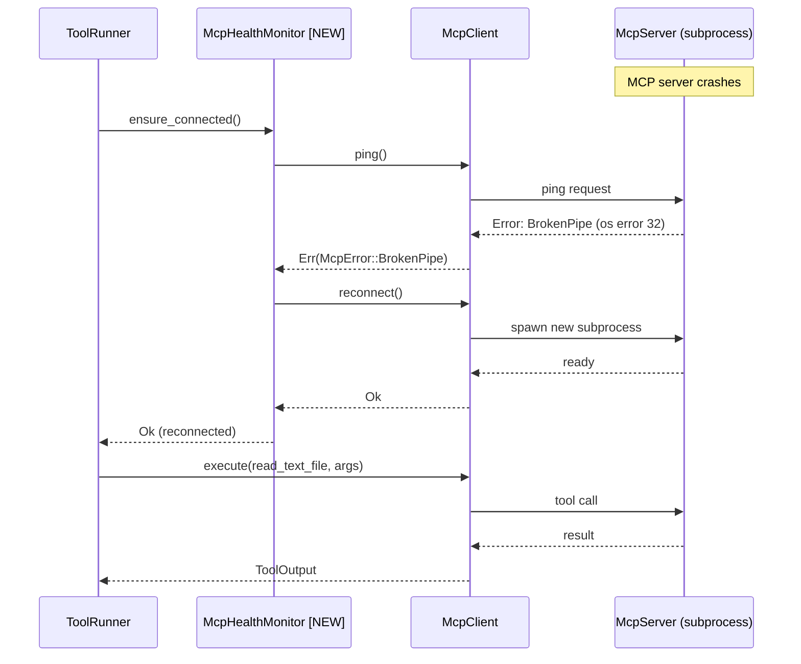
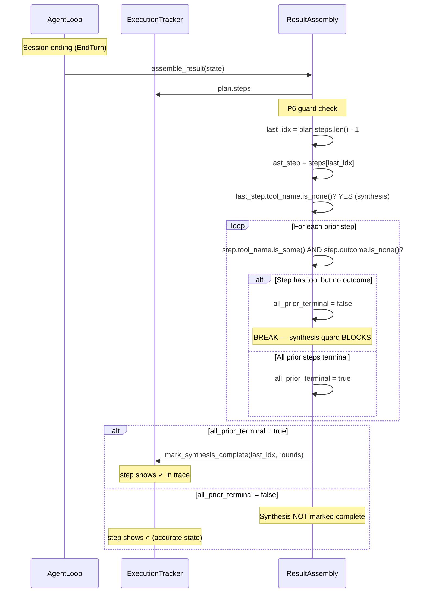
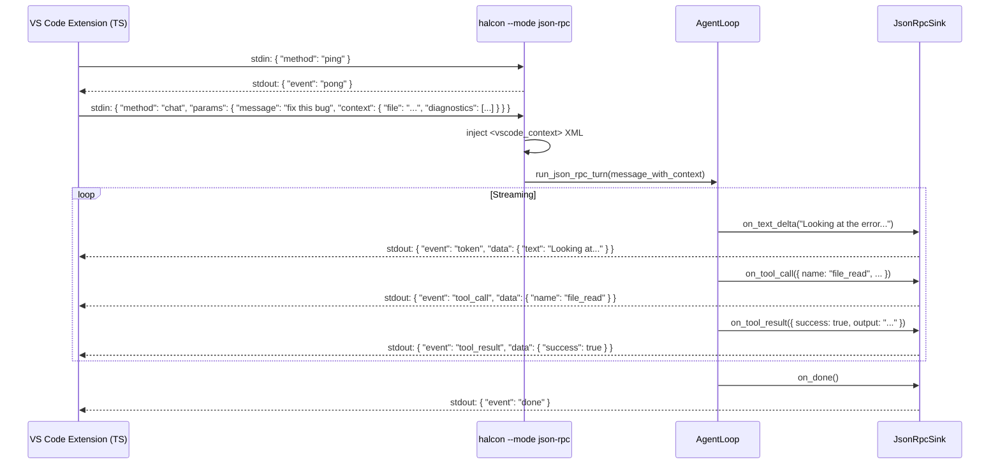
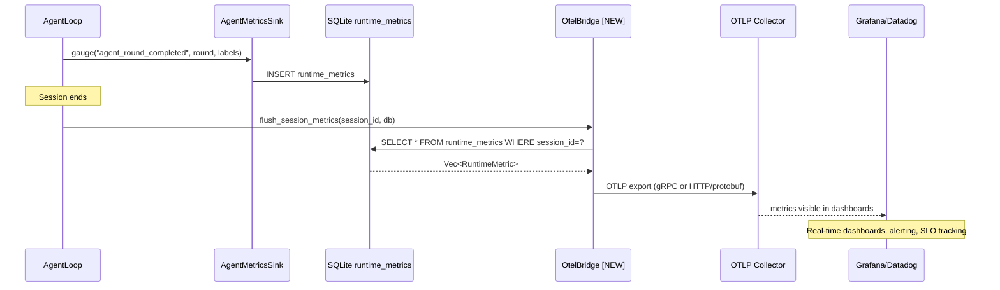

# Sequence Diagrams — Claude Code Integration

> Generated: 2026-03-16 | Format: Mermaid

---

## SD-1: Normal Agent Session (Happy Path)

---

## SD-2: Provider Failover on Credit Exhaustion

---

## SD-3: File Inspect with PDF Feature Not Available (Improved Error Path)

---

## SD-4: Retry with Exponential Backoff

---

## SD-5: MCP Broken Pipe Recovery

---

## SD-6: Synthesis Completion Guard (Fixed)

---

## SD-7: JSON-RPC VS Code Bridge

---

## SD-8: OTLP Metrics Export (New)

